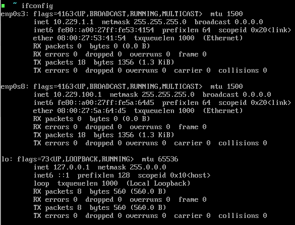
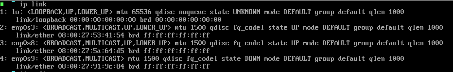
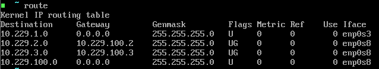

# VM Usage Guide and Troubleshooting

## Contents

1. Linux Host
2. Windows Host
3. Troubleshooting

# 1. Linux Host

### Network Interfaces

When you start up your Linux host, run three commands and make sure the output matches mine:

```sh
ifconfig
```



```sh
ip link
```

  

```sh
route
```



Note: when you run ifconfig, just make sure that both the enp0s3 and the enp0s8 interfaces are up and they have their respective ip addresses: 10.229.1.1 for enp0s3 and 10.229.100.1 for enp0s8. In the screenshot you can see the ip addresses right beside the word `inet`.  

If you only see the loopback interface (lo)

---

# 2. Windows Host


---

# 3. Troubleshooting

## Errors While Importing/Running VMs

### Mac - kernel driver not installed (rc=-1908)

1. If you get this error, go to your system settings and click on Security & Privacy.
2. Go to the general tab and click on the "Allow" button at the bottom next to "System software from developer "Oracle America, Inc" was blocked from loading"
3. You may need to click on the little lock in the bottom left before you can click the Allow button
4. You will have to restart your computer.

### SHA 256 Checksum errors:

This is a weird one. So far these are the two solutions that have worked:
1. Try to delete the VM and import it again. This may take a couple tries.
2. When importing, `dont` click on the "Import hard drives as VDI". Make sure it is unchecked. This will result in a .vmdk hard disk file instead of .vdi
