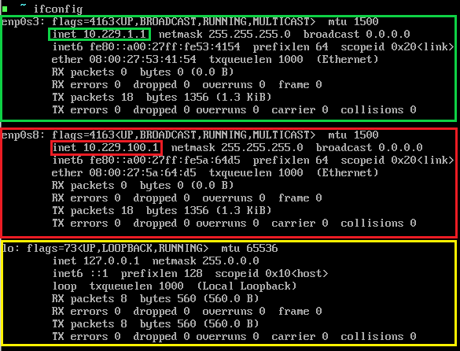

# VM Usage Guide and Troubleshooting

# Table of Contents

1. [Linux Host](#linux-host)
    * [Network Interfaces](#network-interfaces)
    * [Text Editor](#text-editor)
    * [Useful Tools](#useful-tools)
    * [Internet Access](#internet-access)
    * [Shutting Down Your VM](#shutting-down-your-vm)
    * [Change screen resolution](#change-screen-resolution)
    * [Change font size](#change-font-size)
    * [Adding a shared folder](#adding-a-shared-folder)
2. [Windows Host](#windows-host)
3. [Other Linux 1 and 2](#other-linux-1-and-2)
    * [Overview](#overview)
    * [Service Request Format](#service-request-format)
    * [Starting The VM](#starting-the-vm)
    * [Shutting Down The VM](#shutting-down-the-vm)
3. [Troubleshooting](#troubleshooting)


# Linux Host

## Contents:
1. [Network Interfaces](#network-interfaces)
2. [Text Editor](#text-editor)
3. [Useful Tools](#useful-tools)
4. [Internet Access](#internet-access)
5. [Shutting Down Your VM](#shutting-down-your-vm)

### Network Interfaces

When you start up your Linux host, check to make sure your network interfaces are set up correclty. If they are not, you will not be able to do the assignment. **Keep in mind that the intefaces might not be set up correctly the very first time you run your VM, just shut it down and try again. If you have any problems, let me know and I can give you an easy fix.**  

#### First run ifconfig and make sure your output matches the pictures below. I have outlined the three interfaces in color, where:
* Green: enp0s3 - IP address 10.229.1.1
* Red: enp0s8 - 10.229.100.1
* yellow: lo - 127.0.0.1

```sh
ifconfig
```



#### Next, run the following command and make sure you have 4 interfaces: lo, enp0s3, enp0s8, enp0s9.

```sh
ip link
```

  

#### Lastly, lets make sure all routes are correctly in place. The order shouldnt matter much, just make sure you have all four routes:

```sh
route
```


### Text Editor

I have installed Neovim on the Linux Host machine. To run it, type:

```sh
nvim <filename>  # Where <filename> is the path of the file you want to create/edit
```

Neovim is a fork of Vim. 

### Useful Tools

* wget
* ftp
* htop
* tmux
* tcpdump
* hexdump

### Internet Access

I have created a very simple shell script that you can run to "turn on" and "turn off" the internet, so to speak. These are in your path so you can run them from anywhere.

```sh
internet_on.sh   # This will bring up your enp0s9 interface and run dhcpd for an IP address
internet_off.sh  # Release dchcp lease and bring the enp0s9 interface down
```

Note that after you run `internet_on.sh`, you should see an additional `enp0s9` interface when running `ipconfig`. Also if you run the `route` command you will most likely see two new routes like so (notice the two new ones at the top of my list): 

  

After you run `internet_off.sh`, the `enp0s9` should be removed from `ifconfig` output, and your routes should be back to normal.

### Shutting Down Your VM

From the command line, you can type:

```sh
shutdown -h now
```

### Change screen resolution

**`Note`: Do this at your own risk. It worked for me, but I cannot guarantee the same for you.**  

#### First, we enter Grub prompt to determine supported screen resolutions:

1. Turn on VM and hold shift. 
2. When the Grub menu pops up (see below), press c. 
  
3. This will bring you to the Grub prompt (see below).  
  
4. On the prompt type:

```sh
videoinfo 
```

5. Observe the output to determine possible screen resolutions supported (the screenshot from step 3 shows my output).  
6. Then reboot via:

```sh
reboot
```

7. Log in to Linux normally  

```sh
# Edit or add the following line (assuming you want a 1400 X 1050 X 32 resolution)
# GRUB_GFXMODE=1400x1050x32
nvim /etc/default/grub

# Next, update Grub
grub-mkconfig -o /boot/grub/grub.cfg
```


### Change font size
If your font is extremely small, you may want to make it bigger. Keep in mind I have limited experience with this because the font size on my VM was fine so feel free to experiment if you like. Also, I just used terminus-font as an example. There may be other fonts you can use as well.  

1. First, make sure you are connected to the internet, then enter the following:

```sh
pacman -S terminus-font  # Get terminus font
setfont ter-132n         # Change font to larger terminus font
setfont                  # Restore default font
```

### Adding a shared folder

1. First, log on to your VM and create a directory that you want to use as your mount point for sharing with your host OS. (You can use the /home/shared/ directory if you wish. I created this folder for this exact purpose when I made the VMs.) I will assume you are using this path.
2. Make sure the vboxservice is running:
```sh
systemctl status vboxservice 
# If it says enabled, you are good to go. Otherwise you must enable it with the following command:
systemctl enable vboxservice
```
3. Next, shutdown your VM, open VirtualBox and go to the settings for your VM.
4. Click on the Shared Folders tab
5. Click on the green plus sign (on the right) and fill out the apopropriate information

```
Folder Path: the path to a directory on your host OS where you want to share files.
Folder Name: on your host OS
Mount Point: the directory on your guest OS (/home/shared/ for example)
I usually click "Auto-mount" but it is up to you. 
``` 

6. Start VM and log in as root  
7. Note: The persmissions for /home/shared will be changed to group vboxsf   
8. Now you can share files between host and guest OS by using /home/shared on the OurLinux VM and whichever folder you desginated in step 5.

---

# Windows Host

More to come...

---

# Other Linux 1 and 2

## Contents:

1. [Overview](#overview)
2. [Service Request Format](#service-request-format)
3. [Starting The VM](#starting-the-vm)
4. [Shutting Down The VM](#shutting-down-the-vm)

## Overview

These two VMs (`OtherLinux1` and `OtherLinux2`) are merely there for testing purposes. For the most part you will only need to use them to test your firewall rules for part 3 of the assignment. When you run these two VMs, they will continuously send requests to both of you host VMs (`OurWindows` and `OurLinux`) for services that you are firewalling against. 

### Service Request Format

Keep in mind you do not necessarily have to service these requests, they are just there so you can test to see if you firewall rules are correct by monitoring traffic. That being said, every minute each `OtherLinux` VM will send out traffic in the following form (in this order):

* 1 ping to Linux host
* 1 passive FTP request to Linux host
* 1 ping to Windows host
* 1 passive FTP request to Windows host
* 2 pings to Linux host
* 1 active FTP request to Linux host
* 2 pings to Windows host
* 1 active FTP request to Windows host
* SSH request to Linux host
* SSH request to Windows host
* HTTP request to Linux host
* HTTP request to Windows host

### Starting The VM

To start these two VMs you can either start them as you normally would (by clicking the start button), or you can start them in headless mode. In headless mode the VM will run in the background. To start in headless mode simply click on the little downward arrow next to the start button and select headless mode (or detachable if you prefer). If you ever wish to bring the headless/detachable VM to the foreground, just click on the show button in VirtualBox. After doing so, you can always send it to the background again by accessing the menu at the top of the running VM. Click on `Machine->Detach Gui`.

### Shutting Down The VM

You are not able to log into either of these VMs, so your best bet to shut them down is to right click on them in VirtualBox and select `close-->ACPI Shutdown`.

---

# Troubleshooting

## Errors While Importing/Running VMs

### Mac - kernel driver not installed (rc=-1908)

1. If you get this error, go to your system settings and click on Security & Privacy.
2. Go to the general tab and click on the "Allow" button at the bottom next to "System software from developer "Oracle America, Inc" was blocked from loading"
3. You may need to click on the little lock in the bottom left before you can click the Allow button
4. You will have to restart your computer.

### SHA 256 Checksum errors:

This is a weird one. So far these are the two solutions that have worked:
1. Try to delete the VM and import it again. This may take a couple tries.
2. When importing, `dont` click on the "Import hard drives as VDI". Make sure it is unchecked. This will result in a .vmdk hard disk file instead of .vdi


